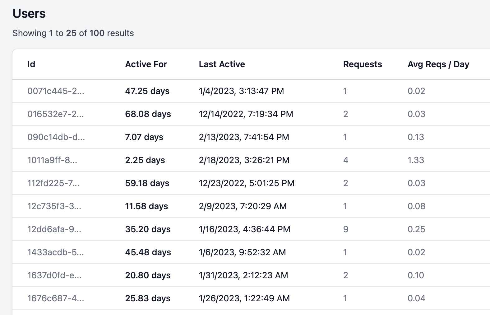

# User Metrics

<figure><figcaption></figcaption></figure>

There are two ways to add user inputs to requests.

### OpenAI API

The OpenAI API has an [optional `user` parameter](https://platform.openai.com/docs/api-reference/completions/create#completions/create-user). By using this option, [OpenAI can also help](https://platform.openai.com/docs/guides/safety-best-practices/end-user-ids) monitor and detect abuse of your end-users.



<pre class="language-bash"><code class="lang-bash">curl https://oai.hconeai.com/v1/completions \
  -H 'Content-Type: application/json' \
  -H 'Authorization: Bearer YOUR_API_KEY' \
  -d '{
    "model": "text-davinci-003",
    "prompt": "How do I log users?",
<strong>    "user": "alicebob@gmail.com",
</strong>}'
</code></pre>



<pre class="language-python"><code class="lang-python">openai.api_base = "https://oai.hconeai.com/v1"

openai.Completion.create(
    model="text-davinci-003",
    prompt="How do I log users?",
<strong>    user="alicebob@gmail.com"
</strong>)
</code></pre>



<pre class="language-javascript"><code class="lang-javascript">const response = await openai.createCompletion({
  model: "text-davinci-003",
  prompt: "How do I log users?",
<strong>  user: "alicebob@gmail.com",
</strong>});
</code></pre>



### Helicone Headers

Alternatively, you can also pass the user ID via headers for Helicone to log. This overrides the OpenAI API in the logs if you specify both.



<pre class="language-bash"><code class="lang-bash">curl https://oai.hconeai.com/v1/completions \
  -H 'Content-Type: application/json' \
  -H 'Authorization: Bearer YOUR_API_KEY' \
<strong>  -H 'Helicone-User-Id: "alicebob@gmail.com"'
</strong></code></pre>



<pre class="language-python"><code class="lang-python">openai.api_base = "https://oai.hconeai.com/v1"

openai.Completion.create(
    model="text-davinci-003",
    prompt="How do I log users?",
    headers={
<strong>        "Helicone-User-Id": "alicebob@gmail.com"
</strong>    }
)
</code></pre>



<pre class="language-typescript"><code class="lang-typescript">import { Configuration, OpenAIApi } from "openai";
const configuration = new Configuration({
  apiKey: process.env.OPENAI_API_KEY,
  basePath: "https://oai.hconeai.com/v1",
  baseOptions: {
    headers: {
<strong>      Helicone-User-Id: "alicebob@gmail.com",
</strong>    },
  },
});
const openai = new OpenAIApi(configuration);
</code></pre>


