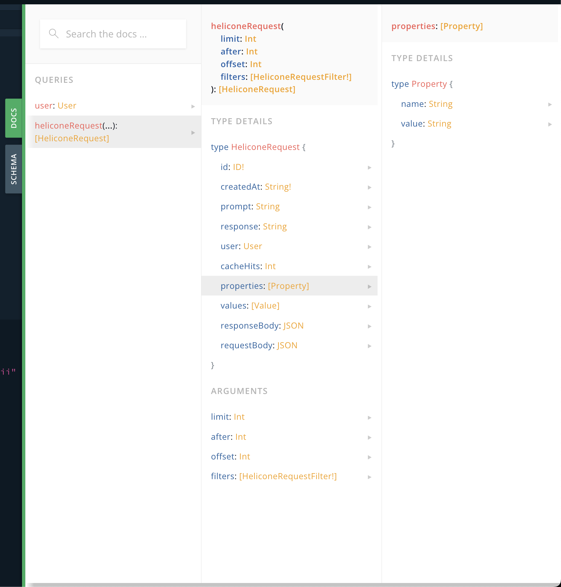

# Getting started

### Setting Up Your API Key

First, grab your `Helicone-API-key` or head to our portal at [https://www.helicone.ai/keys](https://www.helicone.ai/keys) and generate a new key.

<figure><figcaption></figcaption></figure>


### Interactive Playground: Experiment with Queries

In the HTTP Headers section, insert the following block, replacing `HELICONE_API_KEY` with your own:

```json
{
   "authorization": "Bearer HELICONE_API_KEY"
}
```

<figure><figcaption><p>GraphQL Playground Image</p></figcaption></figure>

After you've added your key, here's a sample request to get you started:

```graphql
{
  heliconeRequest(
      limit: 1
      offset: 0
  ) {
      prompt
      properties{
        name
      }
      responseBody
      response
  }
}
```

Our playground is equipped with IntelliSense, a handy tool that makes it easier to understand what types of fields you can query. Just press (ctrl + space)!

### Python Implementation: A Quick Example

Looking to integrate the Helicone API into your Python project? Here's a quick-start guide:

```python
from gql import gql, Client
from gql.transport.aiohttp import AIOHTTPTransport

# Define your URL and headers
url = "https://www.helicone.ai/api/graphql"
headers = {
    "Authorization": "Bearer HELICONE_API_KEY"
}

# Set up the transport and client
transport = AIOHTTPTransport(url=url, headers=headers)
client = Client(transport=transport, fetch_schema_from_transport=True)

# Define your query
query = gql(
"""
    query getContinents {
        heliconeRequest(
            limit: 100
            offset: 0
        ) { 
            prompt
            response
        }
    }
"""
)

# Execute the query and print the result
result = client.execute(query)
print(result)
```

### Accessing the Schema Documentation

You can find the Schema Documentation on the right side of the playground interface. This is your go-to resource for understanding the structure of the data you can query. Visit our playground at [https://www.helicone.ai/api/graphql](https://www.helicone.ai/api/graphql) to explore more!



