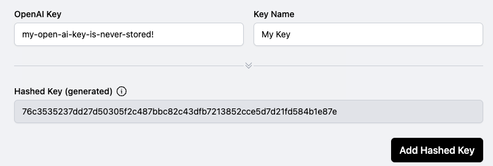

# Encryption and security

### What happens to your OpenAI key

When you call a completions request with Helicone's cloud hosted proxy, we get your OpenAI key to execute the query on your behalf. We also hash your key using the cryptographically secure SHA-256 hash function and log the hash with your response.


**Your OpenAI key is never stored on our servers.**


The first time you login to Helicone's web application, you will enter your OpenAI key. We hash it in your client using the same hash function above and persist only the hash in our server. This is the same practice done with passwords in web applications.

<figure><figcaption>
The OpenAI key is never sent to our servers, only the hash.
</figcaption></figure>

This allows the web application to match your completion requests with your account, even though we never know what your key is.


#### The hash function is irreversible and it is not possible to infer your OpenAI Key from the hash of your keys.


### Want to see the code for yourself? Check out our open-source repository

Helicone is an evolving [open source project ](https://github.com/Helicone/valyr)that is committed to earning the trust of developers.&#x20;

By making our code publicly available, we provide transparency and allow developers to confirm best security practices for themselves and suggest improvements where possible.

